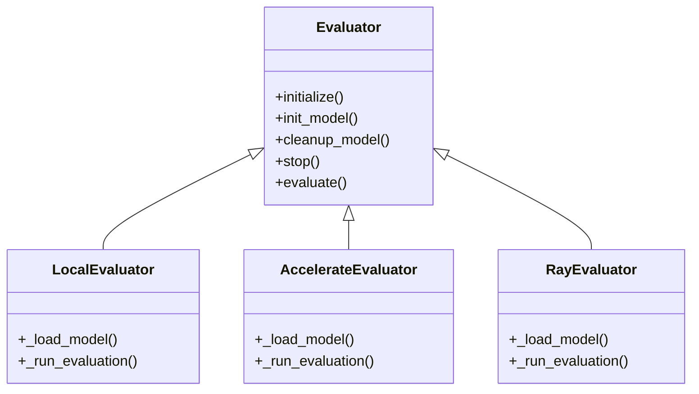

# Evaluator Component

The Evaluator component is responsible for loading and managing machine learning models for evaluation purposes. It provides a base class for different evaluation strategies (Local, Accelerate, Ray) while handling model caching, cleanup, and execution tracking.

## Requirements

1. **Model Loading Requirements**
   - **When** an evaluator is initialized, **the system shall** allow loading models either from a local directory or remote storage.
   - **If** the model is stored remotely, **the system shall** download it to a local cache directory.

2. **Model Caching Requirements**
   - **When** a model is loaded, **the system shall** optionally cache it in memory for a configurable timeout period.
   - **If** the cache timeout expires, **the system shall** automatically clean up the model from memory.

3. **Evaluation Execution Requirements**
   - **When** evaluation is requested, **the system shall** execute the model on the provided dataset and return predictions and/or metrics.
   - **If** metrics are requested, **the system shall** calculate them either in a rolling fashion or after all predictions are complete.

4. **Resource Management Requirements**
   - **When** evaluation completes, **the system shall** properly clean up resources and unload models if not cached.
   - **If** keyboard interrupt occurs, **the system shall** ensure proper cleanup of resources.

5. **Progress Tracking Requirements**
   - **When** evaluation runs, **the system shall** provide configurable verbosity levels for logging progress.
   - **If** a tracker is configured, **the system shall** log evaluation metrics and progress to the specified destination.

## Implementation

### System Diagram

### Components

- **Evaluator**: Base abstract class defining the evaluation interface
- **LocalEvaluator**: Simple single-process evaluator for local execution
- **AccelerateEvaluator**: Evaluator using HuggingFace Accelerate for multi-GPU execution
- **RayEvaluator**: Distributed evaluator using Ray for cluster execution

## Use Cases

1. As a data scientist, I want to evaluate a model on a test dataset, so that I can measure its performance metrics.
2. As an ML engineer, I want to cache models in memory between evaluations, so that I can reduce loading overhead for repeated evaluations.
3. As a researcher, I want to distribute model evaluation across GPUs, so that I can evaluate large models efficiently.
4. As a developer, I want to track evaluation progress and metrics, so that I can monitor long-running evaluations.

### Glossary

- **Model Directory**: Location where model artifacts are stored (local or remote)
- **Cache Directory**: Local directory for storing downloaded model files
- **Cache Timeout**: Duration to keep model loaded in memory
- **Tracker**: Component for logging evaluation metrics and progress
- **Rolling Metrics**: Metrics calculated incrementally during evaluation
- **Batch Size**: Number of samples to process in one forward pass