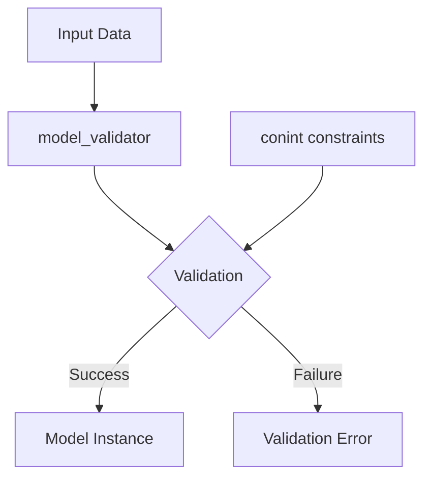

# Pydantic Model Validation

Core validation components from Pydantic used for data validation and model configuration across the framework.

## Requirements

1. **Model Validation Requirements**
   - **When** a model class is defined, **the system shall** use the model_validator decorator to validate and transform input data before model creation.
   - **If** validation fails, **the system shall** raise appropriate validation errors with details about the failure.

2. **Integer Constraint Requirements**
   - **When** an integer field is defined with conint, **the system shall** enforce the specified constraints like minimum/maximum values.
   - **If** an integer value violates the constraints, **the system shall** raise a validation error.

## Implementation

### System Diagram

### Components

- **model_validator**: Decorator for implementing custom validation and data transformation logic
- **conint**: Constrained integer type that enforces value ranges

## Use Cases

- As a developer, I want to validate input data before model creation, so that I can ensure data integrity.
- As a developer, I want to enforce integer constraints, so that I can prevent invalid numeric values.

### Glossary

- **model_validator**: A Pydantic decorator that allows custom validation logic to be applied during model creation
- **conint**: A constrained integer type from Pydantic that enforces minimum/maximum value constraints